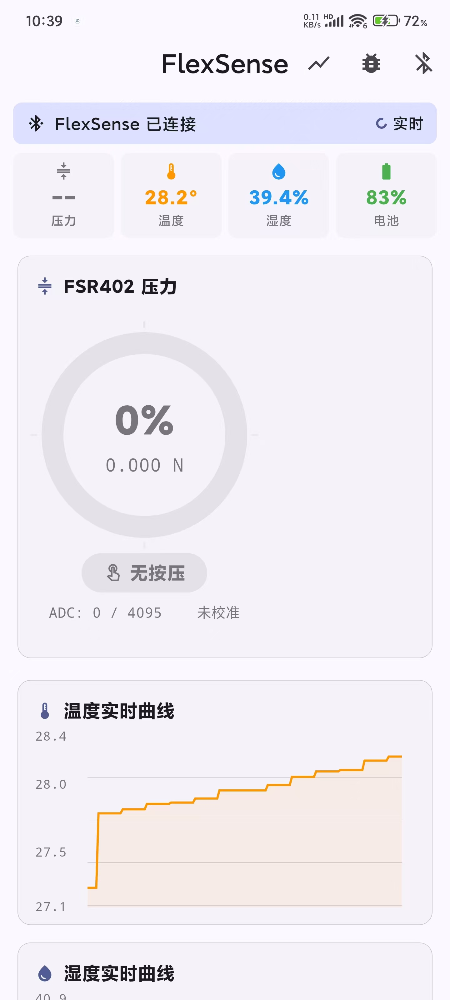
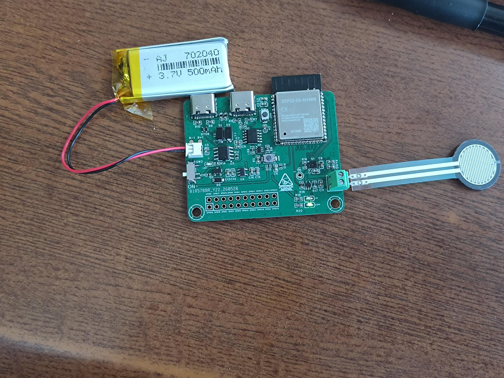

# FlexSense — 柔性传感器物联网节点

面向柔性可穿戴电子研发的物联网边缘节点。系统需实现形变压力与环境温湿度的定时采集、低功耗管理及无线稳定传输。

## 项目背景与技术选型思路

本项目的核心考核点在于无线传输与软硬一体化落地。如果单纯追求极致的低功耗与高精度 ADC，STM32L431（Cortex-M4，80MHz，12-bit ADC，超低功耗）在指标上更为适合，但需外挂 BLE 射频芯片（如 nRF52832），PCB 布局与调试链路均更复杂。

这是我第一次接触锂电池充放电管理电路，同时 FSR402 阻压传感器的模拟量弱信号采集与空间抗干扰调理也是本项目的重难点。我希望将有限的两周时间毫无保留地倾注在这些未知的硬核电路设计与信号调理上。因此，主控选择了手边熟悉的 ESP32-S3 。

### 环境传感器选型：SHT31

在温湿度采集上，本项目最终选型为 SHT31。相比 AHT20，SHT31 的 DFN-8 封装焊盘更大，手工焊接更友好，精度也更高（±0.3°C / ±2%RH），适合本项目的原型验证与手工焊接调试场景。

### 锂电池选型

| 类型            | 标称电压     | 主要特点              |
| ------------- | -------- | ----------------- |
| 锂聚合物（LiPo）    | 3.7V     | 软包，可薄型/异形，形态灵活    |
| 三元锂           | 3.6~3.7V | 圆柱封装（18650），能量密度高 |
| 磷酸铁锂（LiFePO₄） | 3.2V     | 安全性最好，循环寿命长       |

**选型：锂聚合物（LiPo）软包电池**，可做到 3~5mm 厚度，适合可穿戴设备集成。

**关键参数**

| 参数      | 数值                |
| ------- | ----------------- |
| 标称/工作电压 | 3.7V（3.0~4.20V）   |
| 充满/截止电压 | 4.20V / 2.75~3.0V |
| 建议充电电流  | 0.5C~0.8C（≤1C）    |
| 建议放电倍率  | ≥1C               |

**容量选择**：系统峰值 BLE TX 约 176mA。500mAh 电池配 1C 放电倍率可提供500mA 持续电流，覆盖峰值且有余量。

**后级稳压**：从电池到 3.3V 选用 **LDO**（TI TLV75533P）而非 DC-DC。电池放电电压（3.0~4.2V）与 3.3V 压差很小，DC-DC Buck 在此区间优势不明显，反而需外挂电感、占用更大 PCB 面积；且 DC-DC 的开关纹波会耦合到 FSR402 模拟采样链路，LDO 则无此问题。该 LDO 满足 ESP32-S3 ≥500mA 的供电要求，且具备 25µA 低静态电流（适合电池待机）、46dB@100kHz PSRR（对 ADC 采样友好）、238mV max 低压差（电池电压下降时仍可稳定输出）。

### 充电管理方案选型

初版方案采用 IP5306-iic（集成升压转换），且有过充过放等保护和充放电路径管理，路线为电池 → 升压 5V → LDO 3.3V。放弃原因：数据手册简略，初次调试难度大；需处理轻负载自动关机问题；升压转 LDO 两级变换效率估算仅约 58%；升压开关噪声耦合至模拟电源。

最终方案采用 TP4056 纯线性充电 IC，独立管理电池 CC/CV 充电过程，系统直通电池经 LDO 供电。手册完善、外围简洁。TP4056 无充放电路径管理，需通过 PMOS 分立电路实现 USB 插入时的负载切换。

过放保护由成品 LiPo 自带保护板（硬件物理切断）配合软件 ADC 阈值共同承担。

## PCBA 调试状态

SHT31、FSR402 驱动调试正常，锂电池充放电及电压采集均正常。BLE 双特征通道（温湿度 1s / FSR 100ms）推送稳定，Flutter App 全功能就绪。

低功耗管理已完整实现：电池电压 < 3300mV 时自动进入 Deep Sleep（30s 周期），唤醒后检测电压 < 3500mV 则继续睡眠；进入低功耗前通过 BLE data packet flags 通知 App 端显示低功耗警告横幅。

### 硬件选型汇总

| 模块     | 选型型号           | 关键规格                       |
| ------ | -------------- | -------------------------- |
| 主控     | ESP32-S3       | Xtensa LX7 双核, BLE 5.0     |
| 环境传感器  | SHT31          | ±0.3°C / ±2%RH, I²C, DFN-8 |
| 压力传感器  | FSR402         | 阻压型, 分压网络 + TLV521 电压跟随    |
| 电池     | LiPo 软包        | 3.7V / 500mAh / ≥1C        |
| 充电管理   | TP4056         | 线性 CC/CV, 无路径管理            |
| 电源路径切换 | PMOS 分立电路      | USB 插入时切换                  |
| 后级稳压   | TLV75533P      | LDO, 3.3V/500mA            |
| 过放保护   | 电池保护板 + 软件 ADC | \                          |
